# GownerMusic

##Probar Proyecto

>>> 1) Installar tecnologias ```xampp``` (https://www.apachefriends.org/es/index.html)

>>> 2) Borrar todo lo que haya en la carpeta de xampp (C:\xampp\htdocs)
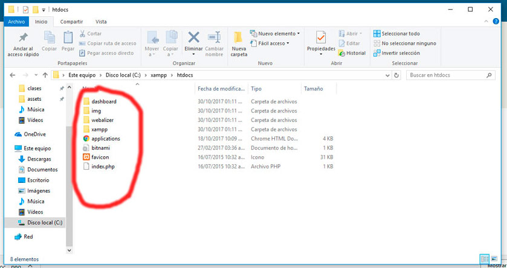

>>> 3) Descargar o traer el repositorio del proyecto si tiene git a la carpeta de xampp [C:\xampp\htdocs]
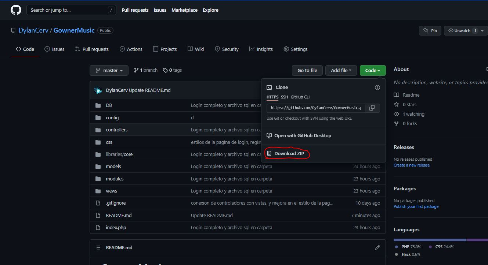

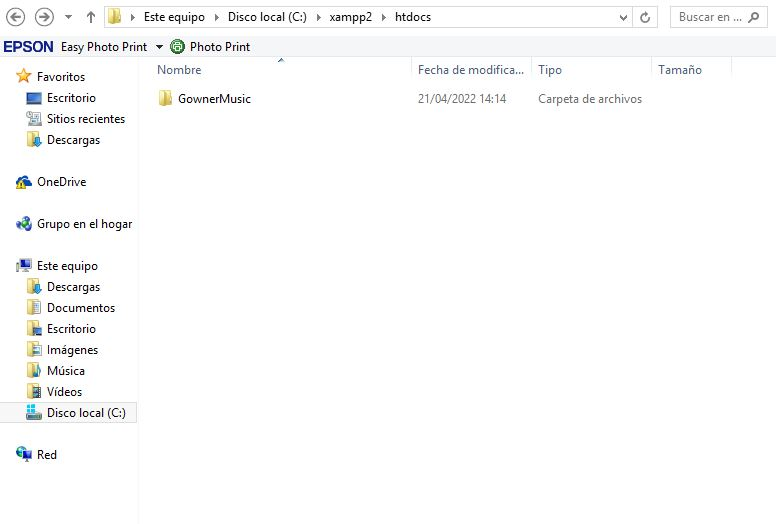

>>> 4) Abrir xampp y correr ```Apache y MySQL```
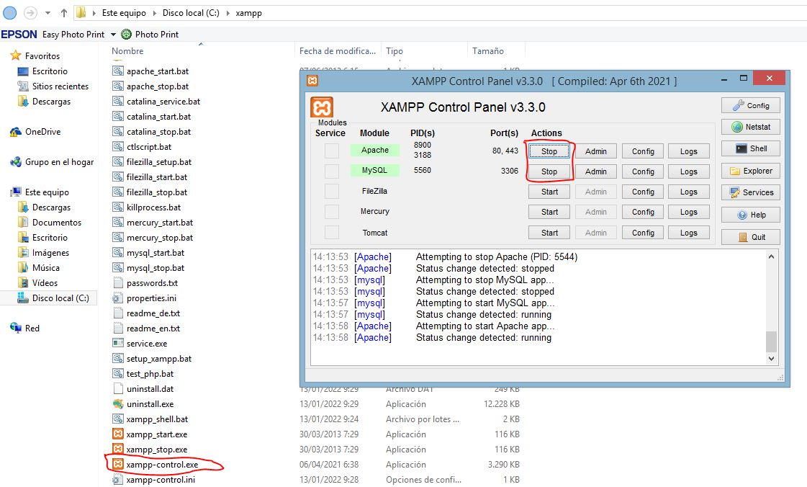


## Importar la Base de datos
>>> 1) Entrar a la carpeta del proyecto llamada ```DB```
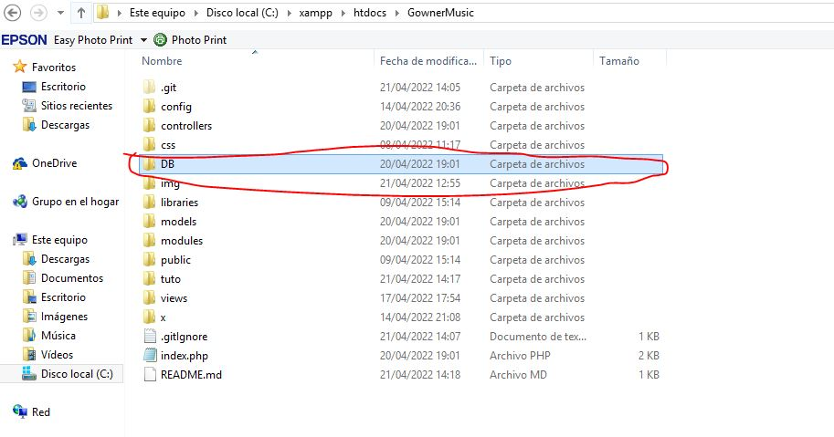

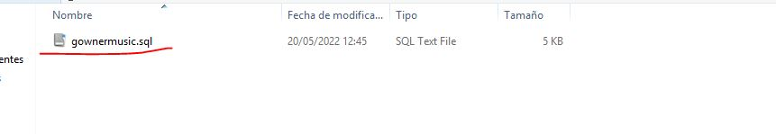


>>> 2) Abrir en el navagador la ruta (http://localhost/phpmyadmin)
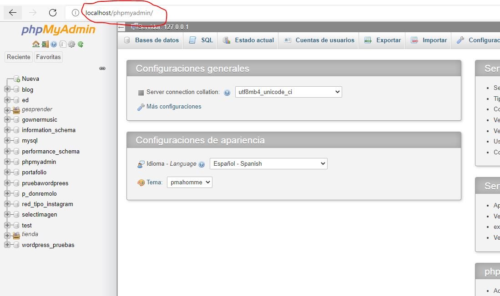

>>> 3) Crear una base de datos llamada ```gownermusic```
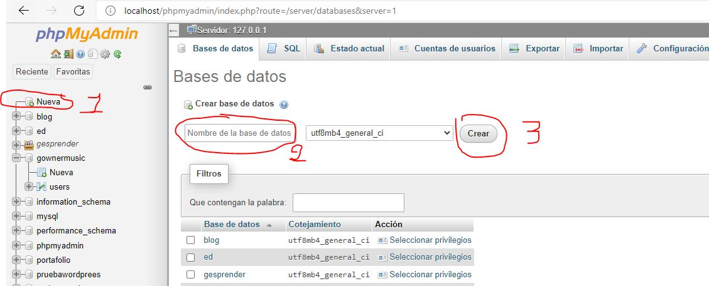

>>> 4) Hacer click en la base de datos creada
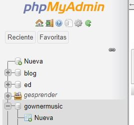

>>> 5) Ir a importar
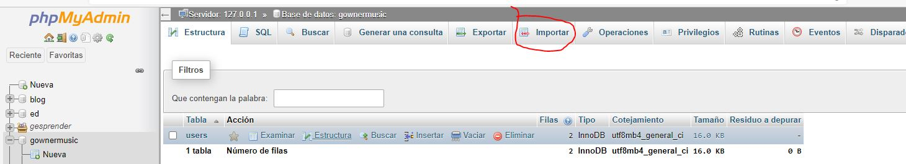

>>> 6) Elegimos el archivo de la carpeta DB del proyecto
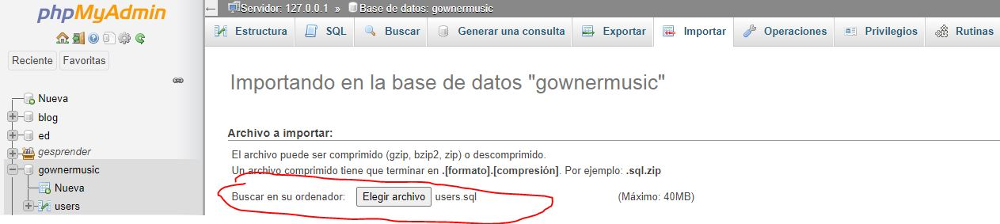


>>> 7) Presionamos en continuar
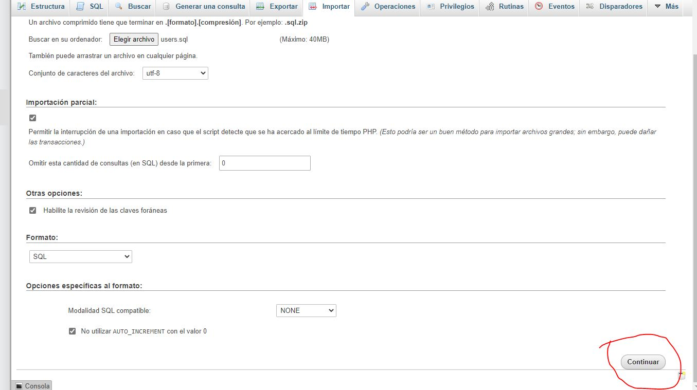

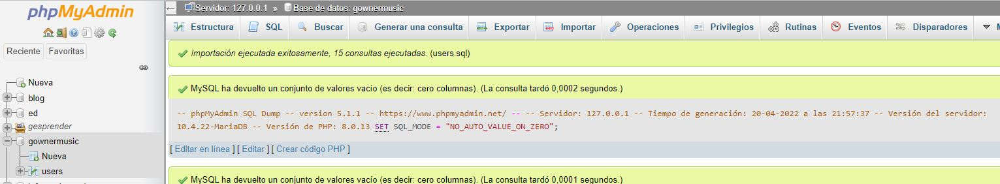

>>> 8) Comprobamos que este la tabla con los registros
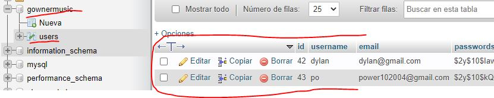


## Ejecutamos el proyecto
>>> 1) Colocar en el navegador la ruta (http://localhost/gownermusic/)
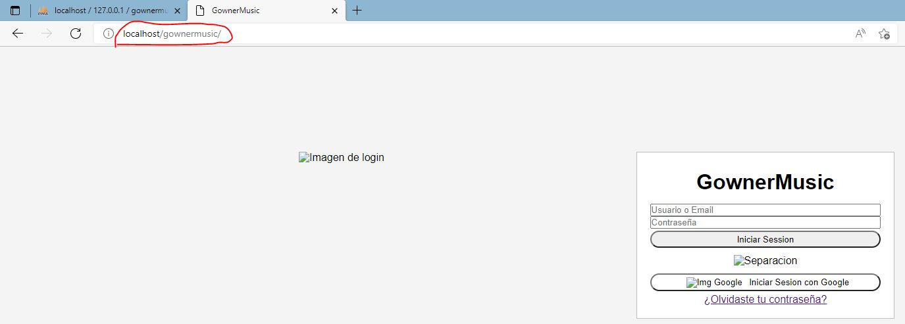


Ya podemos disfrutar el proyecto :)

